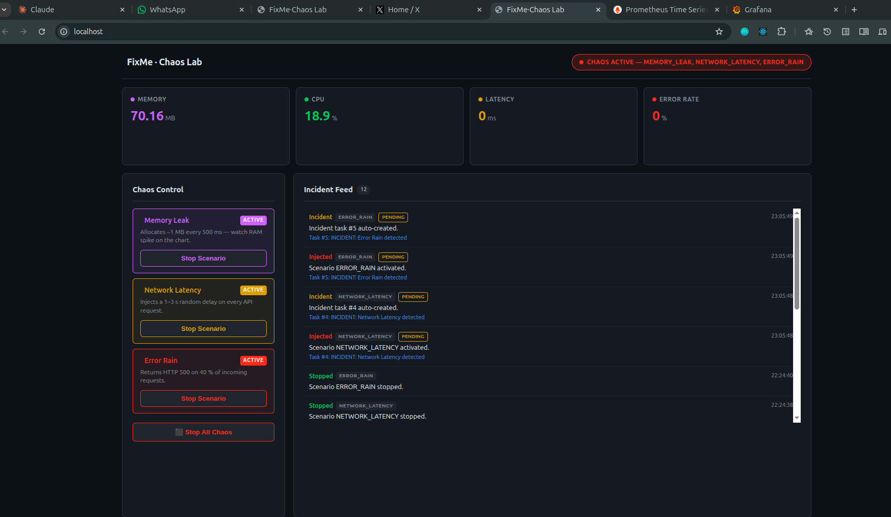
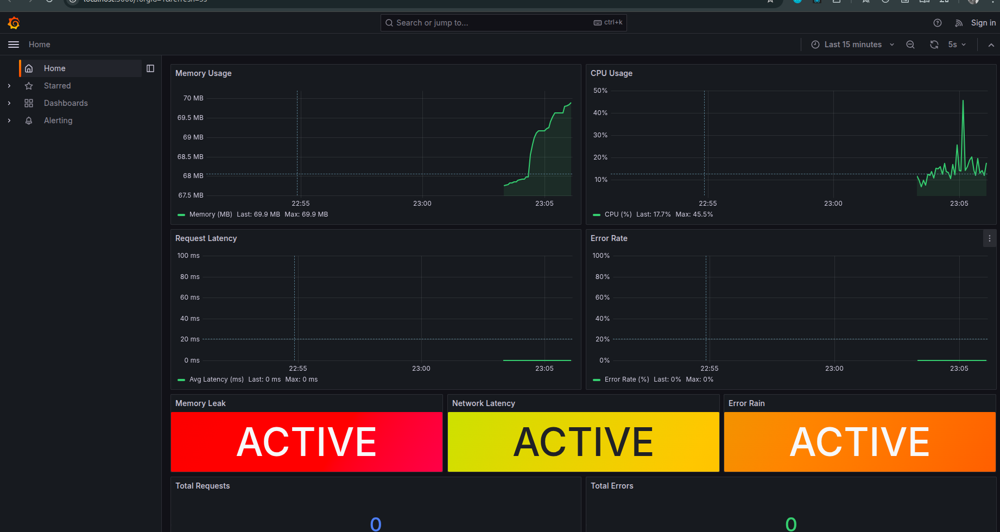
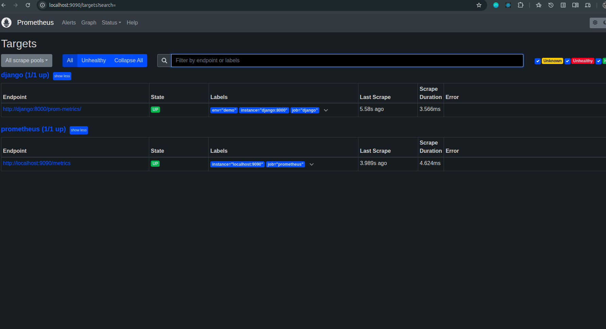

# FixMe · Chaos Lab

A **Proof of Concept** for a **Distributed Incident Simulation and Resolution Platform**.
Inject real failure scenarios into a live Django backend, watch them propagate through the system, and observe every spike in real time on a pre-built Grafana dashboard — all running locally in Docker.

---

## Architecture

```
┌─────────────────────────────────────────────────────────┐
│                     Browser                             │
│   localhost (React UI)   localhost:3000 (Grafana)       │
└────────────┬─────────────────────────┬──────────────────┘
             │ HTTP                    │ HTTP
     ┌───────▼────────┐       ┌────────▼────────┐
     │  nginx:80      │       │  Grafana:3000   │
     │  (React SPA)   │       │  (dashboards)   │
     └───────┬────────┘       └────────┬────────┘
             │ proxy /api/*            │ query
     ┌───────▼────────┐       ┌────────▼────────┐
     │  Django:8000   │◄──────│  Prometheus:9090│
     │  (gunicorn)    │scrape │  (time-series)  │
     └───────┬────────┘       └─────────────────┘
             │
     ┌───────▼────────┐
     │  Redis:6379    │
     │
     └────────────────┘
```

### Key endpoints

| Endpoint | Description |
|----------|-------------|
| `GET  /api/metrics/` | Live JSON metrics — polled by the React frontend |
| `GET  /prom-metrics/` | Prometheus text-format scrape endpoint |
| `POST /api/chaos/inject/` | Activate a chaos scenario |
| `POST /api/chaos/stop/` | Stop one or all scenarios |
| `GET  /api/chaos/status/` | Current state + last 20 events |
| `GET  /api/docs/swagger-ui/` | Swagger UI |

---

## Chaos Scenarios

| Scenario | Effect | What you see in Grafana |
|----------|--------|------------------------|
| `MEMORY_LEAK` | Allocates ~1 MB every 500 ms in a background thread | Memory panel climbs steadily |
| `NETWORK_LATENCY` | Adds a random 1–3 s sleep to every non-chaos request | Latency panel spikes to 1000–3000 ms |
| `ERROR_RAIN` | Returns HTTP 500 on 40 % of requests at random | Error Rate panel climbs toward 40 % |

Each inject automatically creates an **Incident Task** visible in the React UI's Incident Feed.



---

## Running with Docker (recommended)

### Prerequisites

- Docker Engine ≥ 24
- Docker Compose plugin v2 (`docker compose version`)

Install the Compose plugin if needed:
```bash
curl -fsSL https://download.docker.com/linux/ubuntu/gpg \
  | sudo gpg --dearmor -o /usr/share/keyrings/docker.gpg

echo "deb [arch=amd64 signed-by=/usr/share/keyrings/docker.gpg] \
  https://download.docker.com/linux/ubuntu $(lsb_release -cs) stable" \
  | sudo tee /etc/apt/sources.list.d/docker.list

sudo apt update && sudo apt install docker-compose-plugin
```

### Start

```bash
git clone https://github.com/MikeMwita/fixme-backend
cd fixme-backend

cp .env.example .env        

docker compose up --build
```

All five services start in dependency order:

```
redis → django → frontend
              → prometheus → grafana
```

### Access

| Service | URL | Credentials |
|---------|-----|-------------|
| React frontend | http://localhost | — |
| Django API | http://localhost:8000 | — |
| Swagger UI | http://localhost:8000/api/docs/swagger-ui/ | — |
| Prometheus targets | http://localhost:9090/targets | — |
| Grafana dashboard | http://localhost:3000 | admin / chaos123 |

### Stop

```bash
docker compose down          
docker compose down -v      
```

---

## Running locally (without Docker)

### Prerequisites

```bash
sudo apt install -y \
  libsqlite3-dev libbz2-dev libncurses-dev libreadline-dev \
  liblzma-dev libffi-dev libssl-dev tk-dev zlib1g-dev

pyenv install 3.12.0
```

### Backend

```bash
python -m venv .venv
source .venv/bin/activate
pip install --upgrade pip
pip install -r requirements.txt

python manage.py migrate
python manage.py runserver 8000
```

### Frontend

```bash
cd frontend
npm install
npm run dev          # http://localhost:5173
```

> The Vite dev server proxies `/api/*` to `localhost:8000` automatically.

---

## Grafana Dashboard

The dashboard is **auto-provisioned** — no manual import needed.
Open http://localhost:3000 and it loads immediately.

### Panels

| Panel | Metric | Location |
|-------|--------|----------|
| Memory Usage | `fixme_memory_bytes / 1024 / 1024` | Top-left |
| CPU Usage | `fixme_cpu_percent` | Top-right |
| Request Latency | `fixme_latency_ms_avg` | Middle-left |
| Error Rate | `fixme_error_rate_pct` | Middle-right |
| Memory Leak (stat) | `fixme_chaos_active{scenario="MEMORY_LEAK"}` | Bottom row |
| Network Latency (stat) | `fixme_chaos_active{scenario="NETWORK_LATENCY"}` | Bottom row |
| Error Rain (stat) | `fixme_chaos_active{scenario="ERROR_RAIN"}` | Bottom row |
| Total Requests | `fixme_request_count` | Footer |
| Total Errors | `fixme_error_count` | Footer |

Dashboard refreshes every **5 seconds**.
Scenario stat panels turn **RED / YELLOW / ORANGE** when active.



### Prometheus targets

Go to http://localhost:9090/targets to confirm both scrape jobs are **UP**:

- `django (1/1 up)` → scraping `http://django:8000/prom-metrics/`
- `prometheus (1/1 up)` → self-scrape



---

## Demo walkthrough

1. Open http://localhost (React UI) and http://localhost:3000 (Grafana) side by side.

2. **Inject Memory Leak** — click _Inject_ on the Memory Leak card.
   Watch the Memory Usage panel in Grafana climb ~1 MB every 500 ms.

3. **Inject Network Latency** — click _Inject_.
   Fire a request from a terminal and observe the Latency panel spike:
   ```bash
   time curl -s http://localhost:8000/api/tasks/ > /dev/null
   ```

4. **Inject Error Rain** — click _Inject_.
   Send several requests and watch Error Rate climb toward 40 %:
   ```bash
   for i in $(seq 1 20); do
     curl -s -o /dev/null -w "%{http_code}\n" http://localhost:8000/api/tasks/
   done
   ```

5. Check the **Incident Feed** in the React UI — each inject auto-creates a PENDING incident task.

6. Click **Stop All Chaos** — all panels return to baseline.

---

## Common errors & fixes

### `pyenv: version 3.12.0 not installed` / `No module named '_sqlite3'`

Python was compiled without system dev libraries.

```bash
sudo apt install -y \
  libsqlite3-dev libbz2-dev libncurses-dev libreadline-dev \
  liblzma-dev libffi-dev libssl-dev tk-dev zlib1g-dev

pyenv install --force 3.12.0
```

### `error: externally-managed-environment`

Running pip against the Debian system Python. Use the venv pip directly:

```bash
.venv/bin/pip install -r requirements.txt
```

### `HTTP 429 Too Many Requests` on `/api/metrics/`

The default anon throttle rate was too low for the frontend polling interval.
Already fixed in `settings.py` — `anon` rate is set to `300/minute`.

### `Permission denied` (Docker socket)

```bash
sudo usermod -aG docker $USER
newgrp docker
```

### `unknown flag: --build` / `'ContainerConfig' KeyError`

Using the legacy `docker-compose` v1.
Install the modern Compose plugin (see _Prerequisites_ above) and use `docker compose` (with a space).

### `Unable to open configuration file newrelic.ini`

The `wsgi.py` had a hardcoded Mac path for New Relic.
Fixed — New Relic only initialises when `NEW_RELIC_CONFIG_FILE` env var is set.

### `address already in use` (port 8000 or 80)

Kill whatever is occupying the port:

```bash
sudo fuser -k 8000/tcp
sudo fuser -k 80/tcp
```

### `Couldn't find env file: .env`

```bash
cp .env.example .env
```

---

## Project structure

```
fixme-backend/
├── Dockerfile                        # Multi-stage: builder + slim runtime
├── docker-compose.yml                # Full stack: django, frontend, redis, prometheus, grafana
├── entrypoint.sh                     # migrate → gunicorn
├── .env.example                      # Copy to .env before running
├── .dockerignore                     # Keeps build context under 10 MB
├── prometheus/
│   ├── prometheus.yml                # Scrapes django:8000/prom-metrics/ every 5 s
│   └── rules.yml                     # Alert rules (high latency, error rate, CPU)
├── grafana/
│   └── provisioning/
│       ├── datasources/prometheus.yml
│       └── dashboards/
│           ├── dashboards.yml
│           └── chaos_lab.json        # auto-provisioned dashboard
├── frontend/
│   ├── Dockerfile                    # Multi-stage: node build → nginx serve
│   ├── nginx.conf                    # Proxies /api/* to django:8000
│   └── src/
│       ├── components/
│       │   ├── ChaosControls.jsx     # Inject / Stop buttons
│       │   ├── MetricsPanel.jsx      # Live CPU / memory / latency / error charts
│       │   └── IncidentFeed.jsx      # Auto-created incident tasks
│       └── hooks/usePolling.js       # 2-second polling hook
└── fixme/
    ├── chaos/
    │   ├── models.py                 # ChaosConfig, ChaosEvent
    │   ├── views.py                  # inject_chaos, stop_chaos, metrics, prom_metrics
    │   ├── middleware.py             # ChaosMiddleware — applies failures to requests
    │   ├── state.py                  # In-memory leak thread + request stats
    │   └── prom.py                   # Prometheus gauge definitions
    ├── tasks/                        # Incident task management
    ├── authentication/               # JWT auth + RBAC
    ├── replay/                       # Session replay system
    └── config/
        ├── settings.py
        └── urls.py
```

---

## Tech stack

| Layer | Technology |
|-------|-----------|
| Backend | Django 5.2 + Django REST Framework |
| Task queue | Celery + Redis |
| Metrics scraping | Prometheus (`prometheus_client`) |
| Visualization | Grafana 10 (auto-provisioned) |
| Frontend | React 18 + Vite + Recharts |
| Serving | Gunicorn (backend) · nginx (frontend) |
| Containerisation | Docker multi-stage · Docker Compose |
